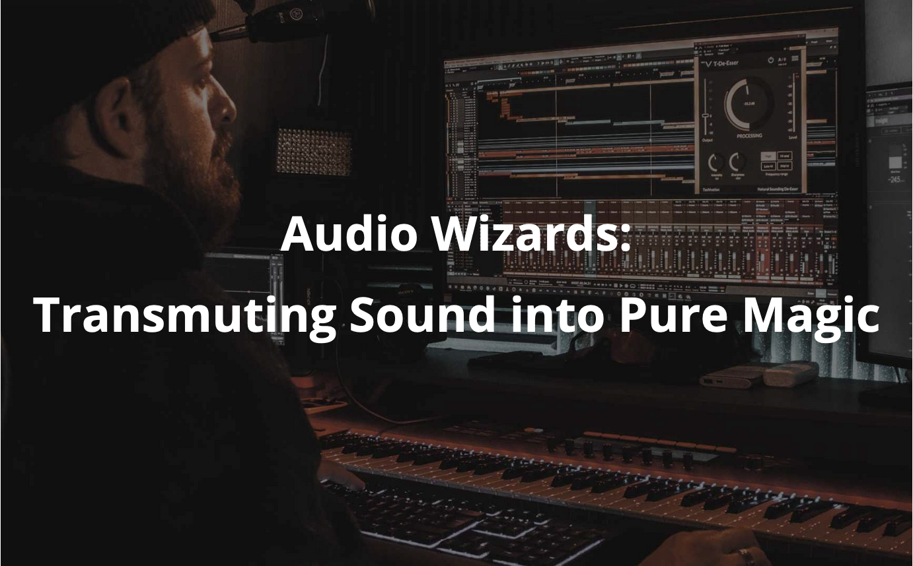

+++
date = "2023-09-14"
title = "BEST Course - Audio Wizards: Transmuting Sound into Pure Magic"

[extra]
start = "2023-09-09"
end = "2023-09-17"
location = ""
+++

Together with BEST, the AES Student Section is organizing the autumn course "Audio Wizards: Transmuting Sound into Pure Magic". It's been a great collaboration between the two student sections! Check out the description of the course below: 

*“Music: the only language that needs no translation.”*

*This Music and Audio Processing course introduces students to the fundamentals of digital signal processing as applied to music. The course introduces concepts that can be used to manipulate and process musical signals. YOU ALL in the course will learn how to use software tools e.g. Python to analyze and manipulate digital audio signals, and will work on exercises that involve implementing and testing various signal processing techniques on music data. The course covers related topics such as music synthesis and audio effects processing. Overall, this course aims to provide students with a strong foundation in the theory and practical applications for music processing.*

*We at BEST Erlangen in collaboration with the Audio Engineering Society (AES) student section Erlangen-Nürnberg and International Audio Laboratories Erlangen (AudioLabs®) (a joint institution of Fraunhofer IIS and Friedrich-Alexander-Universität Erlangen-Nürnberg (FAU)), have put together a fascinating BEST Course in Autumn for you to experience the magic of engineering audio and music. Visit our lovely state of Bavaria and collect some precious audio experiences along the way!*

*Whether you see yourself as a DJ or a music researcher, Franconia awaits you with great food, Franconian beers, German and Indian Culture! Erlangen is home to one of the oldest beer festivals in Germany. Furthermore, we have the highest density of breweries in the world, amazing lakes, and beautiful hills. To sum it all up:*

*You better lose yourself in the music, the moment*

*You own it, you better never let it go*

*You only get one shot, do not miss your chance to blow*

*Cuz this opportunity comes once in a lifetime.*

Find more details [here](https://course.best-erlangen.de/#core-team)

<!-- show more -->

