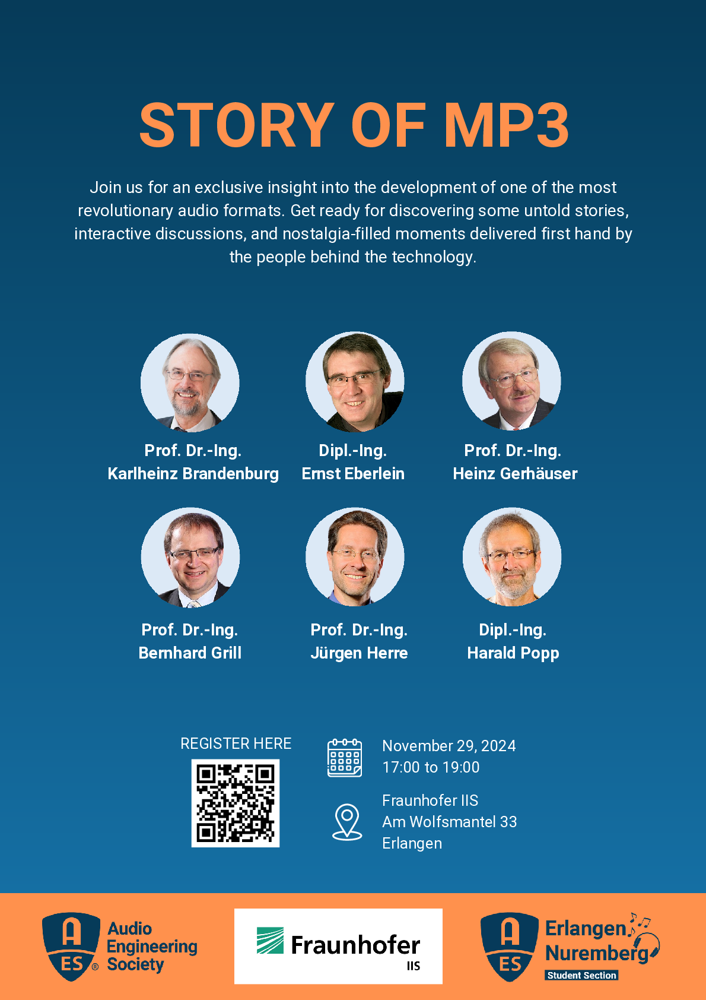

+++
date = "2024-11-29"
title = "Story of MP3"

[extra]
start = "17:00"
end = "19:00"
location = "Am Wolfsmantel 33, Erlangen"
+++

Join us for the Story of MP3 event, where we will explore the history, 
development, and revolutionary impact of the MP3 codec on the music 
industry. Hear directly from the pioneering engineers behind the MP3 
codec in a panel discussion followed by a live Q&A session. Discover 
lesser-known stories and fun behind-the-scenes insights from the 
engineers who made MP3 possible.

<!-- show more -->

The official program will run from 17:00 to 19:00, followed by a 
networking session with food and drinks, where you can connect with 
other audio enthusiasts and share insights.

<b>Registration link:</b> [https://forms.gle/ue4ci2RKZUn3Rreq6](https://forms.gle/ue4ci2RKZUn3Rreq6)

 

