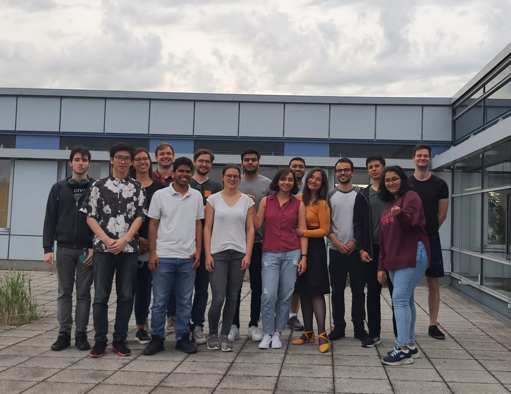

+++
title = "Recap on the AES Spring Gathering"
date = "2022-05-27"
+++

  

Just after a long exhausting Corona situation, our AES student section could finally welcome our members and audio-enthusiasts in person! During the event, Komal and Maryam shared their volunteering experiences of the recently held AES Europe Convention 2022 in The Hague (The Netherlands).  

Being offered drinks and snacks, participants enjoyed the interesting and unique insights of one of the largest audio engineering events in Europe! Right after the presentation, more than 20 people, consisting of not only students but also PhD candidates and audio engineers, talked about their backgrounds, discussed audio-related topics and brainstormed possible future student section activities.  
All in all, everyone had an enjoyable, yet interactive and lively gathering …! :D

